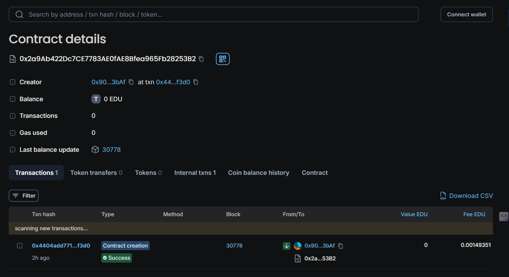

# Internship Marketplace Smart Contract

## Vision

The **Internship Marketplace** is a decentralized platform designed to connect students with employers offering internships. The platform enables employers to post internships, review student applications, and manage stipend payments in a secure and transparent manner. By leveraging blockchain technology, the platform ensures trust and fairness, providing a seamless experience for both employers and students.

## Flowchart

```plaintext
[Employer] --(Post Internship)--> [Internship Marketplace Smart Contract] --(Record Internship)--> [Blockchain]

[Student] --(Apply for Internship)--> [Internship Marketplace Smart Contract] --(Record Application)--> [Blockchain]

[Employer] --(Approve Application)--> [Internship Marketplace Smart Contract] --(Update Application Status)--> [Blockchain]

[Employer] --(Pay Stipend)--> [Internship Marketplace Smart Contract] --(Transfer Funds)--> [Student]
```

## Contract Details

- **Contract Name:** Internship Marketplace
- **Network:** Edu Chain
- **Contract Address:** 0x2a9Ab422Dc7CE7783AE0fAE8Bfea965Fb28253B2
- **Admin:** 0x907fC0C7E6b84F0229c13F57D413F72D33Ff3bAf
- **Current Version:** 1.0.0



## Features

1. **Post Internship:** Employers can create new internship opportunities by specifying company details, the role offered, a description, and the stipend amount.
2. **Apply for Internship:** Students can apply to any active internships by submitting their resume hash.
3. **Approve Application:** Employers can review and approve applications submitted by students.
4. **Pay Stipend:** Employers can pay the approved stipend directly to the student after approval.
5. **Deactivate Internship:** Employers can deactivate any posted internships, making them no longer available for applications.

## Future Scope

- **Rating System:** Implement a rating system for both students and employers to enhance credibility and trust.
- **Escrow Service:** Introduce an escrow service to hold stipends securely until the internship is completed successfully.
- **Internship Completion Certificates:** Issue blockchain-based completion certificates as verifiable credentials for students.
- **Multi-Signature Wallets:** Allow stipends to be managed by multi-signature wallets for added security.
- **Advanced Matching Algorithms:** Develop algorithms to match students with internships based on skills, interests, and previous experience.

## How to Use

1. **Deploy the Contract:** Deploy the contract on your preferred Ethereum network.
2. **Post Internships:** Employers can post internships by calling the `postInternship` function with the relevant details.
3. **Apply for Internships:** Students apply by calling the `applyForInternship` function, submitting their resume hash.
4. **Approve Applications:** Employers can approve applications through the `approveApplication` function.
5. **Pay Stipends:** Once approved, stipends can be paid by calling the `payStipend` function.

## Contact Information

For any queries or support, please reach out to:

- **Name:** Aryan Bramhane
- **Email:** aryan@risein.com
- **LinkedIn:** [Your LinkedIn Profile]
- **GitHub:** [Your GitHub Profile]

